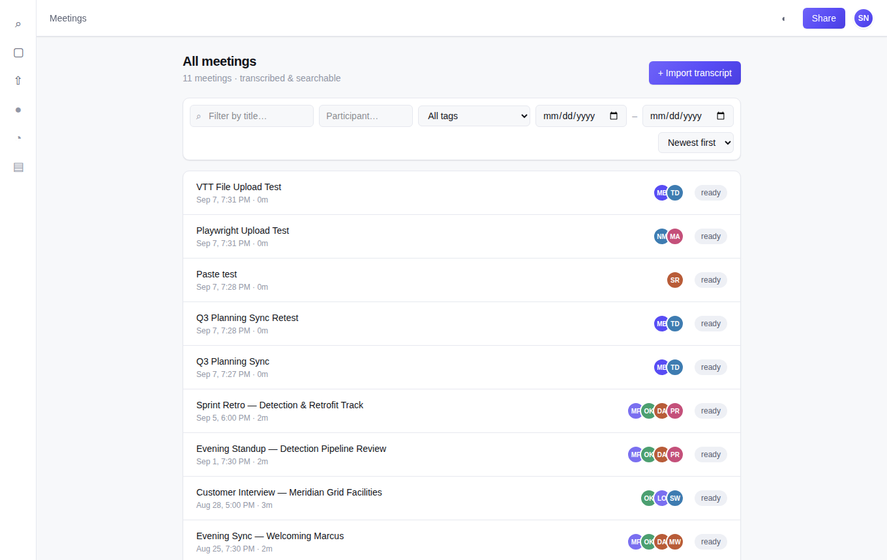
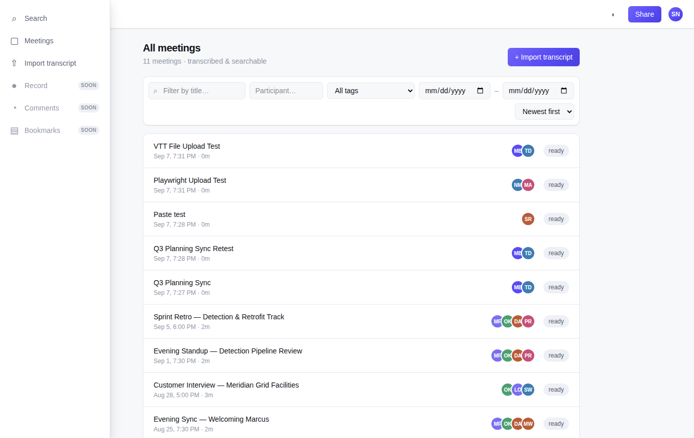
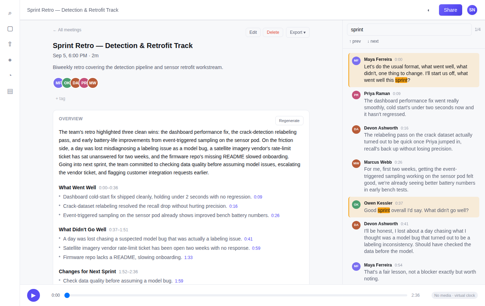
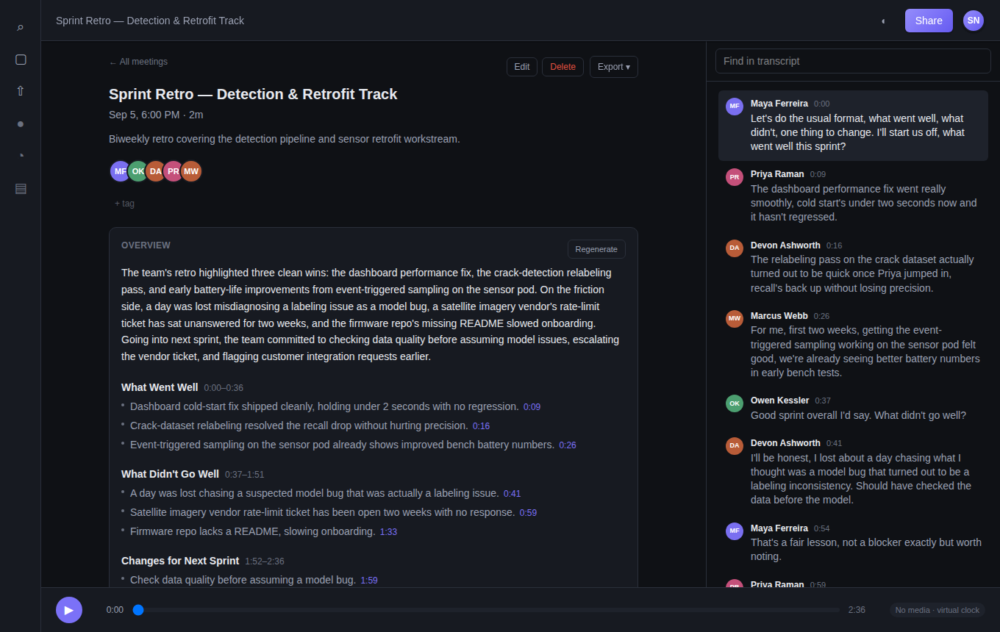
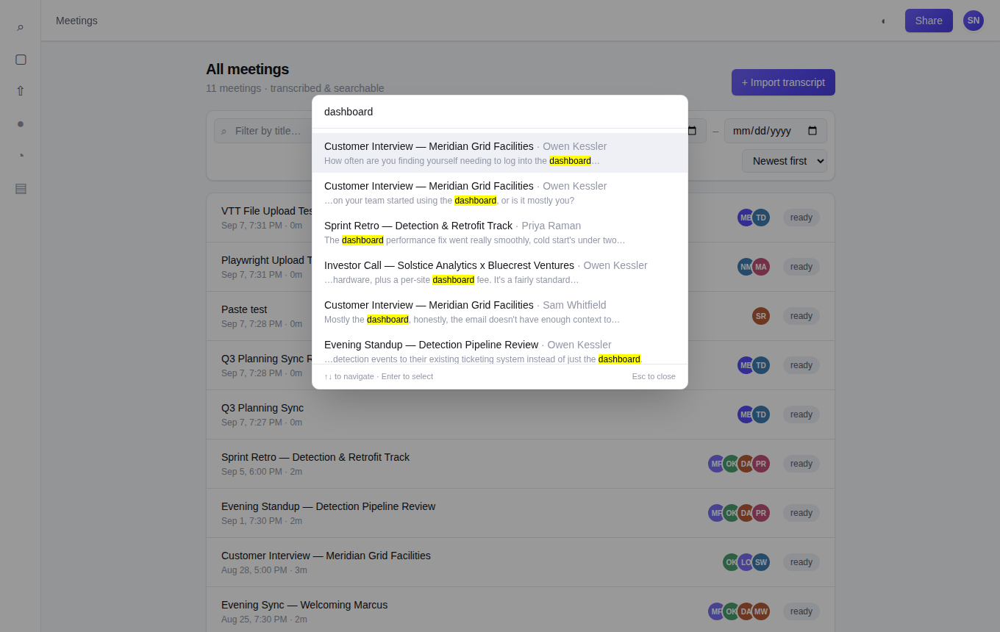
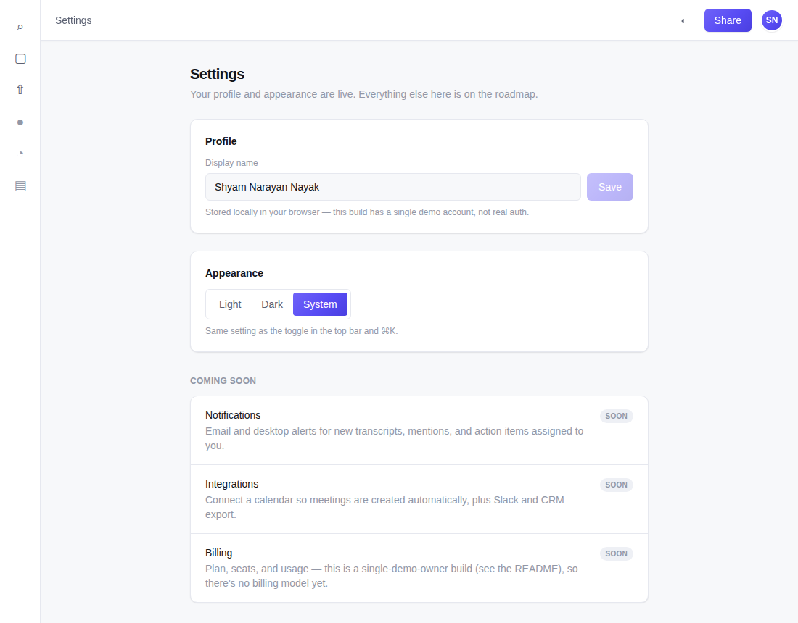

# Meeting Notes & Transcription Platform (Fireflies.ai Clone)

Scaler SDE Fullstack Assignment — Shyam Narayan Nayak.

A meeting-recording workspace modeled on Fireflies.ai: transcripts, AI summaries, action
items, tags, and search, built as a Next.js + FastAPI app on Postgres/SQLite.

**Live demo:** [fireflies-ai-clone-scaler-sde-assig.vercel.app](https://fireflies-ai-clone-scaler-sde-assig.vercel.app) · API: [fireflies-ai-clone-scaler-sde-assignment.onrender.com](https://fireflies-ai-clone-scaler-sde-assignment.onrender.com) ([`/docs`](https://fireflies-ai-clone-scaler-sde-assignment.onrender.com/docs) for interactive API docs)

> The backend is on Render's free tier — the first request after a period of idle takes
> ~50s to cold-start. That's expected, not a broken link.

<video src="https://raw.githubusercontent.com/ShyamNayak27/Fireflies.ai-Clone---Scaler-SDE-Assignment-/main/docs/demo-video.mp4" controls="controls" width="100%" autoplay loop muted style="max-width: 100%;"></video>



## Contents

- [Quick start](#quick-start)
- [Screenshots](#screenshots)
- [Architecture](#architecture)
- [Database schema](#database-schema)
- [API overview](#api-overview)
- [What's built](#whats-built)
- [Testing](#testing)
- [Deployment](#deployment)
- [Assumptions & known limitations](#assumptions--known-limitations)

For the full design rationale — every architecture decision, trade-off, and the scaling
path — see [`docs/ARCHITECTURE.md`](docs/ARCHITECTURE.md). This file is the practical
map: what exists, how it fits together, and how to run it.

## Quick start

**Backend**

```bash
cd backend
pip install -e ".[dev]"
cp .env.example .env
alembic upgrade head
python -m app.seed.seed   # idempotent — safe to re-run
uvicorn app.main:app --reload --port 8000
```

API docs at `http://localhost:8000/docs`. Health check at `/healthz`.

**Frontend**

```bash
cd frontend
npm install
echo "NEXT_PUBLIC_API_URL=http://localhost:8000" > .env.local
npm run dev
```

App at `http://localhost:3000`.

## Screenshots

| Library — filters, sort, hover sidebar | Meeting detail — summary, transcript search, edit/delete/export |
|---|---|
|  |  |

| Dark theme | ⌘K command palette (global search) | Settings |
|---|---|---|
|  |  |  |

## Architecture

```
┌────────────────┐      HTTPS/JSON      ┌──────────────────┐        ┌──────────────┐
│  Next.js (RSC)  │ ───────────────────▶ │     FastAPI       │ ─────▶ │  Postgres /   │
│  App Router,    │ ◀─────────────────── │  router → service │ ◀───── │  SQLite (WAL) │
│  Tailwind v4    │   problem+json err.  │  → repository     │        │  + FTS5 index │
└────────────────┘                      └──────────────────┘        └──────────────┘
                                                  │
                                                  ▼
                                         in-process job runner
                                        (ingest, summarize, RAG)
```

| Layer | Choice | Why |
|---|---|---|
| Frontend | Next.js 16 (App Router), TypeScript | Server components render the library and meeting detail with real data on first paint — no client-side loading flash. |
| Styling | Tailwind v4, CSS custom-property design tokens | One `globals.css` token set drives light/dark/system theming — components never branch on theme themselves. |
| Frontend data | A thin `fetch` wrapper (`lib/api/client.ts`) + React state/hooks | The app's data shape is simple enough that a client-cache library (React Query, etc.) would add indirection without buying much — see note below. |
| Backend | FastAPI, Pydantic schemas | Async by default; Pydantic models double as the OpenAPI contract at `/docs`. |
| Backend layering | router → service → repository → model, enforced by `import-linter` | Routers only know HTTP; repositories are the only place SQL is written. Not just documented — a CI check fails the build if a layer is skipped. |
| ORM | SQLAlchemy 2.0 (async, typed) + Alembic | Typed models keep the repository layer honest; Alembic migrations are real, not hand-edited schema. |
| Database | SQLite (WAL + FTS5) locally, Postgres (Supabase) in production | Same code path either way — a `SearchBackend` seam swaps FTS5's `bm25()` for Postgres's `tsvector`/`ts_rank` depending on the active dialect. |
| Background jobs | In-process asyncio tasks + a `jobs` table | Ingest and summarization return `202` with a job id the client polls — the table is the durable contract, the executor is swappable for Celery/RQ later without changing the API. |
| Testing | pytest (backend), Playwright (e2e) | Real HTTP against a real server in both — no mocked responses. |

> **Note on the frontend data layer:** an earlier design pass planned TanStack Query and
> Zustand for server/client state (still listed as dependencies). The shipped app doesn't
> use either — plain `fetch` + component state turned out to be enough for this data
> shape, and pulling in a cache library for a handful of endpoints would have been
> unused ceremony. Worth pruning the unused packages before a real audit.

### Backend layout

```
app/
├── routers/       HTTP only — request in, response out, no SQL
├── services/      business logic — no SQL, no HTTP
├── repositories/  the only layer that writes SQL
├── models/        SQLAlchemy ORM models
├── schemas/       Pydantic request/response contracts
├── ai/            summarizer + RAG chat, both provider-swappable
└── core/          config, db session, cache, error handling, rate limiting
```

### Frontend layout

```
src/
├── app/            routes (App Router) — library, meeting detail, new meeting, settings
├── components/     layout (rail, top bar, toasts, command palette), meetings, settings
└── lib/            api client, theme, playback hooks, formatting
```

## Database schema

Postgres in production, SQLite (WAL) locally — same schema either way. Timestamps are
ISO-8601 UTC strings; every duration and position is an integer millisecond, never a
float, so seeks and range queries stay exact integer comparisons.

| Table | Purpose | Key relationships |
|---|---|---|
| `users` | The (single, demo) account | owns `meetings` |
| `meetings` | Core meeting record — title, timing, status, source | belongs to a user; has participants, segments, a summary, chapters, action items, tags |
| `participants` | People in a meeting — doubles as the speaker table | belongs to a meeting |
| `transcript_segments` | One row per spoken turn, ordered by `idx` | belongs to a meeting; optional speaker (`participants`) |
| `summaries` | AI-generated (or seeded) overview paragraph | one-to-one with a meeting |
| `chapters` | Named time ranges within a meeting | belongs to a meeting; has notes |
| `notes` | A timestamped bullet under a chapter | belongs to a chapter |
| `action_items` | Tasks extracted from a meeting | belongs to a meeting; optional assignee (`participants`) and source segment |
| `tags` / `meeting_tags` | Free-form labels, many-to-many | `meeting_tags` joins `meetings` ↔ `tags` |
| `comments` | A note attached to one transcript segment | belongs to a segment |
| `highlights` | A selected character range on a segment | belongs to a segment (range, not a text copy — an edit can't orphan it) |
| `soundbites` | A named clip of a meeting (start/end ms) | belongs to a meeting |
| `jobs` | Background task state (ingest, summarize) | optionally linked to a meeting |

Every foreign key is `ON DELETE CASCADE`, so deleting a meeting cleanly removes its
segments, summary, chapters, action items, tags, comments, highlights, and soundbites —
verified against the actual database, not just assumed from the schema.

Full `CREATE TABLE` statements and the indexing rationale live in
[`docs/ARCHITECTURE.md` §4](docs/ARCHITECTURE.md#4-data-model).

## API overview

All error responses are `problem+json` ([RFC 7807](https://www.rfc-editor.org/rfc/rfc7807)) — one shape for the frontend to handle, not a different ad-hoc error format per endpoint. List endpoints use cursor pagination, not offsets.

**Meetings**

| Method | Path | Purpose |
|---|---|---|
| `GET` | `/api/meetings` | List, with `cursor`, `limit`, `tag`, `q`, `participant`, `date_from`, `date_to`, `sort` |
| `GET` | `/api/meetings/{id}` | Meeting detail |
| `PATCH` | `/api/meetings/{id}` | Edit title/description |
| `DELETE` | `/api/meetings/{id}` | Delete (cascades to every child row) |
| `GET` | `/api/meetings/{id}/transcript` | Transcript segments, cursor-paginated |
| `GET` | `/api/meetings/{id}/summary` | Overview, chapters, notes |
| `POST` | `/api/meetings/{id}/summarize` | Regenerate summary → `202` + job id |
| `POST` | `/api/meetings/{id}/ask` | RAG chat — ask a question, get a cited answer |
| `GET` | `/api/meetings/{id}/export` | Download as Markdown or plain text |

**Action items, tags, annotations**

| Method | Path | Purpose |
|---|---|---|
| `GET`/`POST` | `/api/meetings/{id}/action-items` | List / create |
| `PATCH`/`DELETE` | `/api/action-items/{id}` | Edit, complete, or remove |
| `GET` | `/api/tags` | Every tag in use, for filter UIs |
| `POST`/`DELETE` | `/api/meetings/{id}/tags`, `/api/meetings/{id}/tags/{tag_id}` | Attach (get-or-create) / remove a tag |
| `GET`/`POST`/`DELETE` | `/api/meetings/{id}/comments`, `/api/segments/{id}/comments`, `/api/comments/{id}` | Comment on a segment |
| `GET`/`POST`/`DELETE` | `/api/meetings/{id}/highlights`, `/api/segments/{id}/highlights`, `/api/highlights/{id}` | Highlight a range on a segment |
| `GET`/`POST`/`DELETE` | `/api/meetings/{id}/soundbites`, `/api/soundbites/{id}` | Named clip of a meeting |

**Ingest, search, jobs**

| Method | Path | Purpose |
|---|---|---|
| `POST` | `/api/meetings/ingest` | Upload a file or paste text → `202` + job id |
| `POST` | `/api/recordings` | Upload a browser mic recording → `202` + job id |
| `GET` | `/api/jobs/{id}` | Poll job status/progress |
| `GET` | `/api/search` | Global full-text search across all transcripts, ranked with snippets |
| `GET` | `/healthz` | Liveness check |

Full request/response schemas are generated live from the code at `/docs` (Swagger) and
`/redoc` on the running backend — that's the authoritative reference, not a hand-maintained
copy of it here.

## What's built

Everything below has been exercised over real HTTP against a real running server, not
just written and assumed correct.

- Meeting library: list, filter (title, participant, tag, date range), sort, detail view
- Ingest: file upload and pasted transcript, both async via a job/poll pipeline
- Live recording: browser mic capture → upload → the same job pipeline
- Transcript with click-to-seek, virtual playback clock when there's no real media, and search with visually distinct match highlighting
- Summary, chapters, notes (seeded; not yet LLM-generated on ingest — see below)
- Action items: full CRUD, complete-and-sort-to-bottom
- Meeting edit (title/description) and delete, with cascade cleanup
- Global full-text search (⌘K command palette) and per-transcript search
- Tags, comments, highlights, soundbites — backend CRUD is complete and tested; comments/highlights/soundbites have no dedicated frontend UI yet (tags do)
- Export a meeting to Markdown or plain text
- Dark/light/system theme, persisted per-browser, no flash of the wrong theme
- RAG "ask this meeting" chat with citations
- Toast notifications for edits, deletes, and sharing
- A working Settings page (display name, theme) with a clear "coming soon" section for what isn't

Not built: `ETag`/`304` revalidation, and automatic summarization on ingest — summary
and chapters are currently seed-time content only.

## Testing

```bash
# Backend — from backend/
ruff check .
mypy app
lint-imports          # layering rule: routers -> services -> repositories
pytest -v             # 45 tests

# Frontend — from frontend/
npx tsc --noEmit
npm run lint
npm run build

# End-to-end (needs both servers already running, per "Quick start" above)
npm run test:e2e      # 6 Playwright specs
```

CI (`.github/workflows/ci.yml`) runs all of the above on every push/PR: `ruff` + `mypy`
+ `import-linter` + `pytest` for the backend, `tsc` + `lint` + `build` for the frontend,
then Playwright against both servers started for real — nothing mocked.

## Deployment

| Piece | Where | Config |
|---|---|---|
| Database | Supabase Postgres | `DATABASE_URL` (session pooler host, `postgresql+asyncpg://` prefix) |
| Backend | Render web service | `render.yaml` — build runs migrations, boot runs the idempotent seed then `uvicorn` |
| Frontend | Vercel | `frontend/vercel.json` — `NEXT_PUBLIC_API_URL` points at the Render URL (build-time, requires a redeploy if changed) |

Full step-by-step deploy instructions are in [`docs/ARCHITECTURE.md` §11](docs/ARCHITECTURE.md#11-deployment).

## Assumptions & known limitations

- **Auth is mocked.** Every request acts as a single demo owner; the schema is already
  multi-tenant-shaped (`owner_id` leads every root table and every index) so real auth
  is additive, not a rewrite.
- **Summaries and chapters are seed-time content**, not generated automatically on
  ingest. The summarizer is built and swappable (`"seeded" | "heuristic" | "llm"`) but
  isn't yet wired to fire when a meeting finishes processing.
- **Real transcript source files were not available during development** — the parser
  registry and normaliser were built and tested against representative fixtures.
- **Live transcription requires `OPENAI_API_KEY`**; without one, recording still
  captures and uploads audio, but the job fails loudly with a clear error instead of
  silently producing nothing.
- **Export supports Markdown and plain text, not PDF** — a real library dependency,
  not a from-scratch feature, and wasn't prioritized within the time budget.
- **`PATCH /api/meetings/{id}` can't currently clear a description** — passing
  `description: null` is (incorrectly) treated as "leave it alone" rather than "clear
  it," since the field only updates when it isn't `None`. Known, not yet fixed.

All seeded meetings are **fictional** — an invented company, invented people, invented
figures — written to match the cadence of a real standup or pitch call without
containing a real one. See [`docs/ARCHITECTURE.md` §1](docs/ARCHITECTURE.md#1-goals-and-non-goals) for why.
